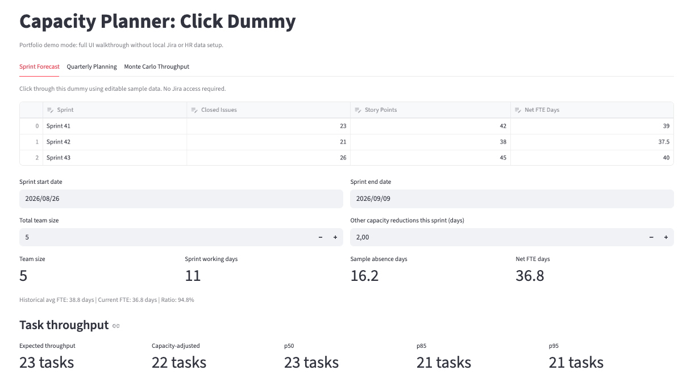
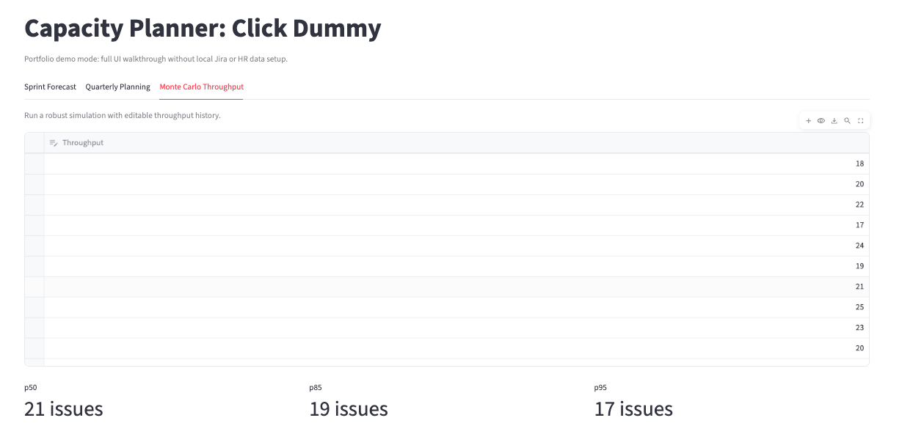
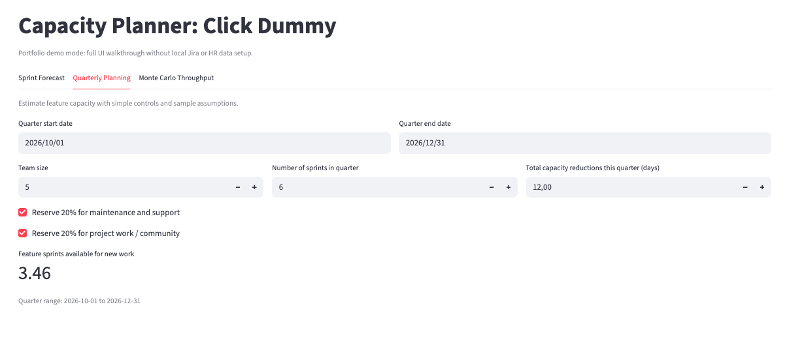

# Capacity Planner
A lightweight tool for forecasting sprint capacity using Jira data.

Status: ✅ MVP ready

## About
Built to automate a manual quarterly capacity planning process 
previously maintained in Excel. Designed for any delivery team 
using Jira and knows upcoming absences — product managers, engineering managers, 
scrum masters, or anyone responsible for sprint planning.

The tool runs locally on each user's machine with their own 
Jira credentials and absence export. No shared infrastructure, 
no hosting costs. Streamlit is free when run locally.

Accepts any absence file in CSV or XLSX format. No specific HR tool required.

## What it does
- Pulls the last completed Jira sprints automatically
- Reads planned absences from any CSV or XLSX file
- Calculates net team capacity using rule-of-three planning
- Supports sprint forecasting and release-level Monte Carlo simulation
- Produces a capacity forecast per sprint for planning discussions

## Tech stack
- Python
- Streamlit
- Jira Agile REST API
- CSV or XLSX absence file (any source)

## Setup
1. Clone the repository

   ```bash
   git clone <your-repository-url>
   cd capacity-planner
   ```

2. Create a virtual environment

   ```bash
   python3 -m venv venv
   source venv/bin/activate
   ```

3. Install dependencies

   ```bash
   pip3 install -r requirements.txt
   ```

4. Configure credentials

   ```bash
   cp .env.example .env
   ```

   Update `.env` with your Jira details:
   - `JIRA_BASE_URL`: `https://yourcompany.atlassian.net`
   - `JIRA_EMAIL`: your Jira account email
   - `JIRA_API_TOKEN`: create an API token in Jira
   - `JIRA_PROJECT_KEY`: the prefix before issue numbers, for example `ALPHA`

5. Run the app

   ```bash
   python3 -m streamlit run app.py
   ```

   This opens the portfolio click-dummy mode by default (no Jira or absence file setup required).

## Advanced Mode (Jira Integration)
Run the full integration app when you want live Jira-based planning.

```bash
python3 -m streamlit run app_integration.py
```

## Visual Demo
Sprint Forecast



Quarterly Planning



Monte Carlo Throughput



## How to use
1. Upload your absence file in the sidebar.
2. Enter your Jira board ID and click **Load Sprints**.
3. In the Sprint Forecast tab:
   - Set sprint start and end dates.
   - After loading sprints, enter the net FTE days available in each of the last 3 sprints.
   - Values are saved to `sprint_history.json` and reused when the same sprints appear again.
   - Click **Update Forecast** to calculate the capacity-adjusted forecast.
4. In the Monte Carlo Throughput tab, define a simulation date range to estimate release throughput using recent historical sprint data.
5. In the Quarterly Planning tab, set the quarter window to estimate feature capacity available for planning.

## Notes
- This project is designed for any organization using Jira for sprint tracking and an absence file for time-off data.
- Board IDs and project keys are configurable per team or project.
